


&nbsp;&nbsp;

## I build things for the web.

Sou **Kauã**, desenvolvedor Full-Stack focado em transformar ideias em produtos digitais.

Trabalho principalmente com **websites, sistemas web, plataformas SaaS, e-commerce, automações e integrações com inteligência artificial**.

Gosto de projetos que combinam **engenharia e design**: sistemas bem estruturados por dentro e simples de usar por fora.


Procuro entender o problema por trás do projeto, pensar na arquitetura, organizar os dados e criar uma experiência que faça sentido para quem vai usar o produto.


O objetivo é sempre o mesmo: **criar algo que funcione bem, seja fácil de usar e possa evoluir com o tempo.**




  
  
  
  
  
  
  
  
  
  
  
  
  
  
  
  
  
  
  
  
  
  
  
  
  
  
  
  
  
  
  
  
  
  
  
  
  
  
  
  
  










<picture>
  <source media="(prefers-color-scheme: dark)" srcset="https://raw.githubusercontent.com/kauassnt/kauassnt/pacman-output/bomberman-contribution-graph-dark.svg">
  <source media="(prefers-color-scheme: light)" srcset="https://raw.githubusercontent.com/kauassnt/kauassnt/pacman-output/bomberman-contribution-graph.svg">
  
</picture>


Se você quiser conversar sobre um projeto, colaboração ou trocar uma ideia sobre tecnologia:

&nbsp;&nbsp;

  

